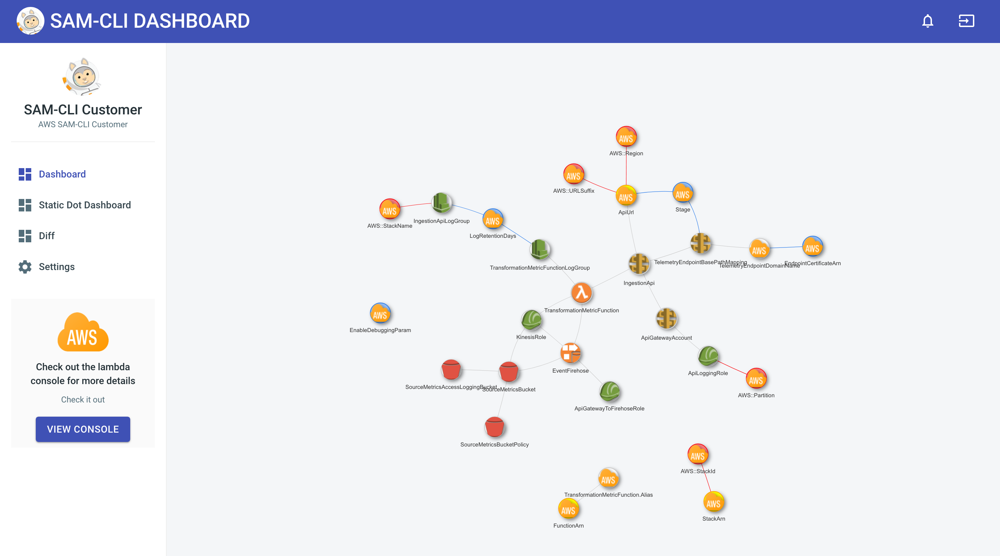

## SAM-CLI Dashboard

## Quick start

- Make sure your NodeJS and npm versions are up to date for `React 16.8.6`

- Install dependencies: `npm install` or `yarn`

- Start the server: `npm run start` or `yarn start`

- Views are on: `localhost:3000`

## Design Files

[Download .sketch file](https://s3.eu-west-2.amazonaws.com/devias/products/react-material-dashboard/react-material-dashboard-free.sketch)

## License

- Licensed under MIT (https://github.com/viksrivat/sam_cli_dashboard/LICENSE.md)

# Credits

UI Extended from https://github.com/devias-io/react-material-dashboard

# Ideas

Update UI 
- One click deploy template
- Electron app to download and run
- Don’t assume that a template is loaded initially
- Specify Credentials in the settings
- Drag and Drop template
- Takes Xray+CloudTrail+CloudWatch and combines the data on all three to view the current state of the app
- Allow for quick local development for a deployed stack
- IAM Policy Editor
    - Tab to load a template and view relationships between any two services
        - Drag visually the service in order to say that it is implicitly invoked
        - React-digraph is really good for this
            - Save the relationships as part of MetaData within the template
    - Policy Sim and easily click which items you want
        - Side Pane
- Generate Dashboard
    - — pipeline
        - Creates a pipeline and the ci system for the repo based on the start right setup?
    - Load from SAR repo, GitHub, bitbucket, code commit, gitlab
        - Initialize git repo
        - Rip of from vue init
        - boto3.client(‘serverlessrepo’).
        - Git clone part of urI
- frame and search SAR
    - paginator = client.get_paginator('list_applications')
    - Generate item by item and click check out
- View Logs of a certain resources
- Load template and validate via cli
    - SAM Validate with cfn-lint
- Pricing System
    - Based on input provide a log of how the resources will cost as the resources will scale
        - Simple toggle of requests is required + costs of each resources scrapped via beautiful soup
        - data and networking costs
        - Display red flags when tier is crossed
    - Prediction tool
        -  Cost over a time period as requests scale based on the history or a linear function